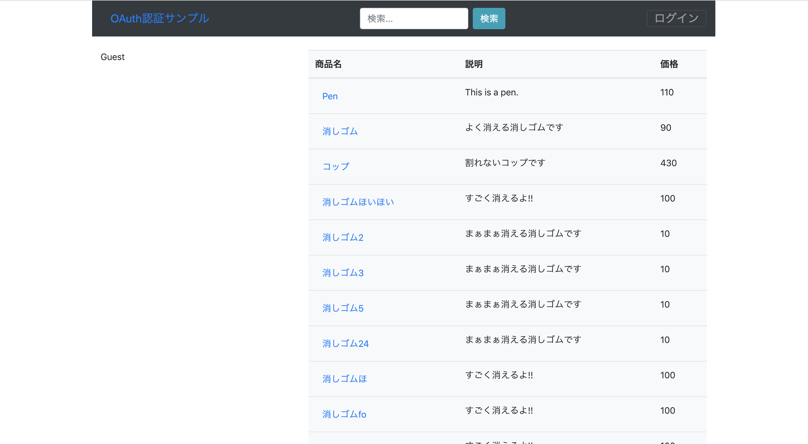
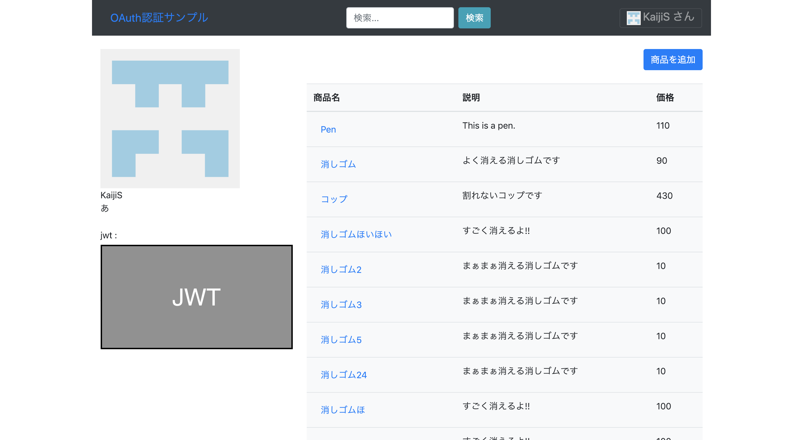
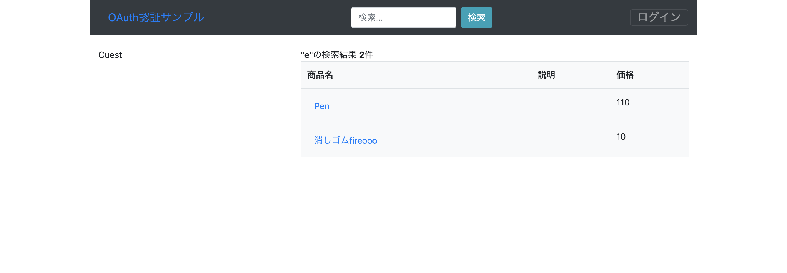
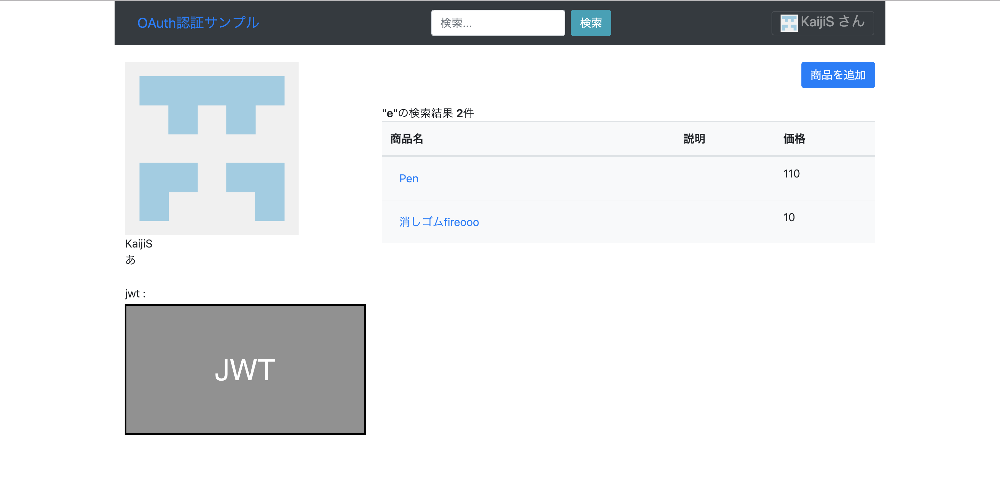
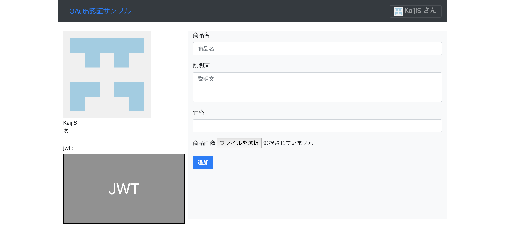
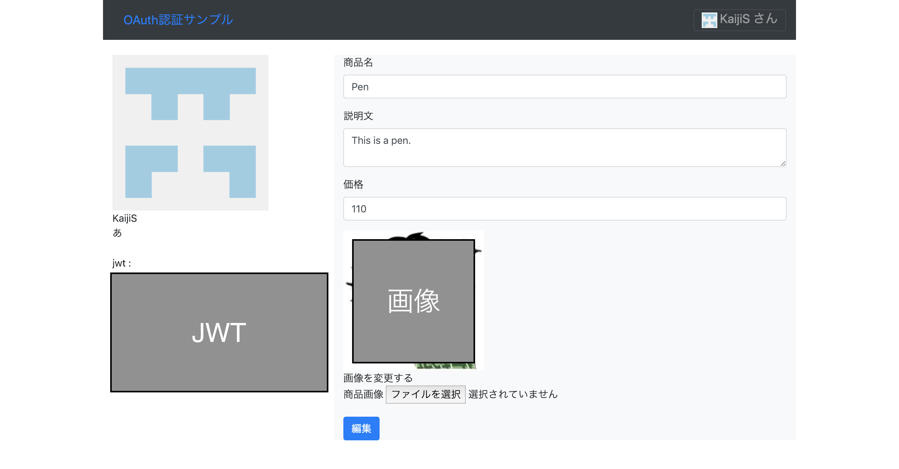

# EC_exercise  / OAuth2を利用したユーザ認証 と CRUD

使用したライブラリ ("library/oauth2/"の中)  
http://oauth2-client.thephpleague.com/    

## 画面例  

基本的には，画面左側にログインしたユーザ情報

#### top - ログイン前

  

#### top - ログイン後  

  

#### header - ログイン前

  

#### header - ログイン後

 

#### 商品情報 - ログイン前

 

#### 商品情報 - ログイン後

 

#### 商品検索 - ログイン前

 

#### 商品検索 - ログイン後

 

#### 商品追加 - ログイン後のみ

 

#### 商品編集 - ログイン後のみ

 